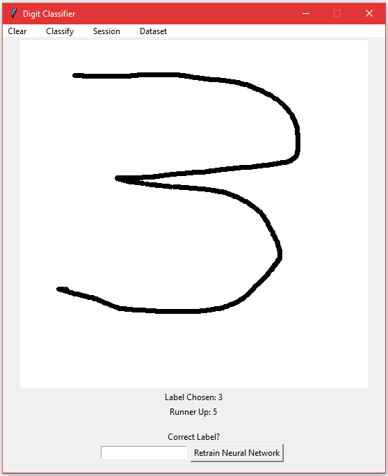

# Digit Recognition README
To properly use the "Dataset" options in the top-level menu, **you must install and save the test and train datasets** from 
[here](https://pjreddie.com/projects/mnist-in-csv/) to a new directory in the parent directory named "mnist_dataset".

This project is derived from following the book, Make Your Own Neural Network by Tariq Rashid. That being said, although modified, much
of the code is from Tariq Rashid.

## The Graphical User Interface

## Features
You can load an already trained classifier from the "load session" command accessed from the top-level menu under the "sessions"
drop-down. Once loaded, you can draw a digit zero through nine and have it classified by selecting the "classify" button. 

Alternatively, you can train the neural network yourself by drawing digits and filling in the label in the bottom
of the window and click "retrain". 

Once trained the artificial neural network can be saved and loaded for a future session. 

If one wants to augment their manual training with more training examples, then they can [download the MNIST training data](https://pjreddie.com/projects/mnist-in-csv/)
and select "Train from MNIST Dataset" from the "Dataset" drop-down menu. The time taken to train your data can take anywhere
from 2 to 20 minutes depending on your computers processing power. 